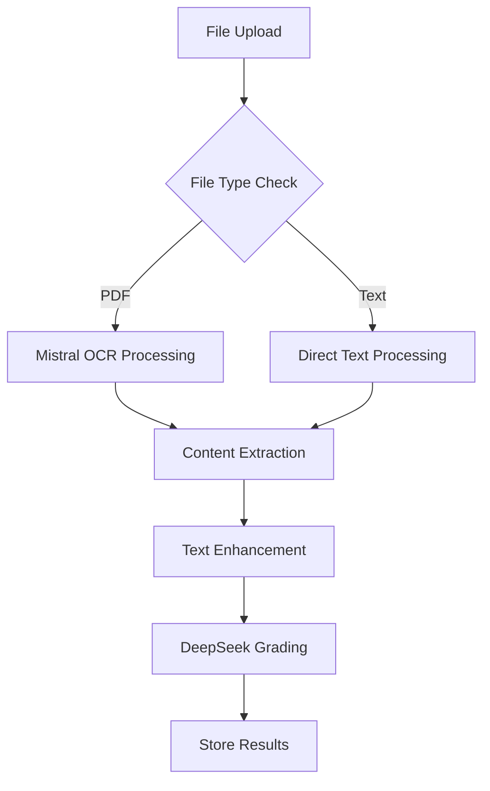

# Chinese Learning Platform Backend

A Quart-based backend service for the Chinese learning platform, featuring PDF processing with OCR capabilities, and AI-powered grading using DeepSeek and Mistral APIs.

## 🚀 Quick Start

### Prerequisites

- Python 3.8+
- pip (Python package manager)
- Virtual environment (recommended)
- Supabase account and project
- DeepSeek API key
- Mistral API key

### Environment Setup

1. Create and activate a virtual environment:

```bash
python -m venv venv
source venv/bin/activate  # On Windows: .\venv\Scripts\activate
```

2. Install dependencies:

```bash
pip install -r requirements.txt
```

3. Create a `.env` file in the backend directory:

```env
SUPABASE_URL=your_supabase_project_url
SUPABASE_SERVICE_ROLE_KEY=your_supabase_service_role_key
DEEPSEEK_API_KEY=your_deepseek_api_key
MISTRAL_API_KEY=your_mistral_api_key
PORT=5000  # Optional, defaults to 5000
```

### Running the Server

1. Start the development server:

```bash
python app.py
```

The server will start on `http://localhost:5000` by default.

## 📚 API Documentation

### Test Endpoint

- `GET /api/test`: Verify backend is running
  - Response: `{"message": "Backend is running successfully!"}`

### Profile Endpoints

- `GET /api/profile/<user_id>`: Get or create user profile
  - Creates new profile if none exists
  - Returns profile data and success message

### Grading Endpoints

- `POST /api/grade`: Submit and grade assignments
  - Request: Multipart form data
    - `files`: PDF or text files to grade
    - `gradingCriteria`: Grading rubric
    - `submissionId`: Unique submission identifier
    - `totalPointsAvailable`: Maximum points (default: 100)
  - Response: Grading results with detailed feedback

## 🔧 Core Components

### PDF Processing

- Handles PDF file uploads
- OCR processing using Mistral API
- Fallback to PyPDF2 for text extraction
- Supports both text and image-based PDFs

### AI Grading System

- Primary grading using DeepSeek API
- Structured feedback and scoring
- Point-based rubric support
- Partial credit handling

### Mistral Integration

- OCR capabilities for image-based PDFs
- Document understanding and analysis
- Text content processing and enhancement

## 📦 Project Structure

```
backend/
├── app.py              # Main application entry
├── autograder.py       # File processing and grading logic
├── deepseek_grader.py  # DeepSeek API integration
├── mistral_processor.py # Mistral API integration
├── requirements.txt    # Dependencies
└── .env               # Environment variables
```

## 🔍 Dependencies

Key dependencies from requirements.txt:

```
quart
quart-cors
python-dotenv
supabase
mistralai
werkzeug
```

## 🐛 Common Issues

### API Keys

- Ensure all API keys are correctly set in `.env`
- Verify DeepSeek API key has sufficient credits
- Check Mistral API key permissions for OCR

### File Processing

- Ensure PDF files are properly formatted
- Check file size limits
- Verify file permissions

### Supabase Connection

- Verify Supabase URL and service role key
- Check database table permissions
- Ensure required tables exist:
  - profiles
  - submissions
  - submission_results

## 🔐 Security Notes

- Use environment variables for all sensitive data
- Keep API keys secure and never commit them
- Use service role key for Supabase, not anon key
- Implement proper file validation and sanitization

## 📝 License

This project is licensed under the MIT License - see the LICENSE file for details.

## 🔄 Grading Workflow

### 1. Submission Processing



### 2. Detailed Process Flow

1. **File Reception** (`/api/grade`)

   - Receives files via multipart form data
   - Validates submission ID and grading criteria
   - Creates temporary files for processing

2. **Content Extraction**

   - PDF Files:
     ```python
     # Using Mistral's OCR
     content = await mistral_processor.process_pdf(file_path)
     # Fallback to PyPDF2 if OCR fails
     content = extract_with_pypdf2(file_path)
     ```
   - Text Files:
     ```python
     content = await mistral_processor.process_text(raw_content)
     ```

3. **Grading Process** (`DeepSeekGrader`)

   ```python
   {
     "results": [
       {
         "question": "Aspect [points]",
         "mistakes": ["Areas for improvement"],
         "score": "Earned points",
         "feedback": "Detailed explanation"
       }
     ],
     "totalScore": "Total points earned",
     "overallFeedback": "Comprehensive feedback"
   }
   ```

4. **Result Storage**
   - Stores in Supabase `submission_results` table:
     - Original file content (base64)
     - Grading results
     - Submission metadata
     - Timestamps

### 3. Error Handling

1. **OCR Processing**

   - Primary: Mistral OCR
   - Fallback: PyPDF2 text extraction
   - Final Fallback: Error report in results

2. **Grading**

   - Validates point allocations
   - Ensures total score ≤ maximum points
   - Handles partial credit scenarios

3. **Status Updates**
   ```python
   status = {
     'completed': 'All files processed successfully',
     'partial': 'Some files failed',
     'failed': 'No files processed'
   }
   ```

### 4. Performance Optimizations

- Concurrent file processing
- Temporary file cleanup
- Efficient base64 encoding
- Status tracking for long operations
