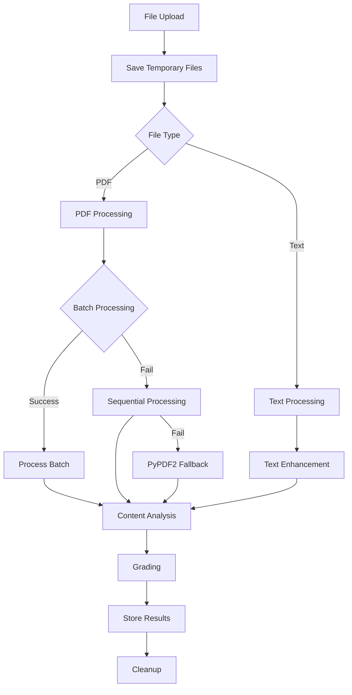

# Chinese Learning Platform Backend

A Quart-based backend service for the Chinese learning platform, featuring PDF processing with OCR capabilities, and AI-powered grading using DeepSeek and Mistral APIs.

## 🚀 Quick Start

### Prerequisites

- Python 3.8+
- pip (Python package manager)
- Virtual environment (recommended)
- Supabase account and project
- DeepSeek API key
- Mistral API key (Free tier or paid plan)

### Environment Setup

1. Create and activate a virtual environment:

```bash
python -m venv venv
source venv/bin/activate  # On Windows: .\venv\Scripts\activate
```

2. Install dependencies:

```bash
pip install -r requirements.txt
```

3. Create a `.env` file in the backend directory:

```env
SUPABASE_URL=your_supabase_project_url
SUPABASE_SERVICE_ROLE_KEY=your_supabase_service_role_key
DEEPSEEK_API_KEY=your_deepseek_api_key
MISTRAL_API_KEY=your_mistral_api_key
PORT=5000  # Optional, defaults to 5000
```

### Running the Server

1. Start the development server:

```bash
python app.py
```

The server will start on `http://localhost:5000` by default.

## 📚 API Documentation

### Test Endpoint

- `GET /api/test`: Verify backend is running
  - Response: `{"message": "Backend is running successfully!"}`

### Profile Endpoints

- `GET /api/profile/<user_id>`: Get or create user profile
  - Creates new profile if none exists
  - Returns profile data and success message

### Grading Endpoints

- `POST /api/grade`: Submit and grade assignments
  - Request: Multipart form data
    - `files`: Multiple PDF or text files to grade
    - `gradingCriteria`: Grading rubric
    - `submissionId`: Unique submission identifier
    - `totalPointsAvailable`: Maximum points (default: 100)
  - Response: Array of grading results with detailed feedback for each file

## 🔧 Core Components

### PDF Processing System

#### Batch Processing

- Supports processing multiple PDFs concurrently
- Uses Mistral's batch API for efficient processing (paid plan)
- Automatic fallback to sequential processing (free tier)
- Multiple fallback layers for reliability:
  1. Batch OCR processing
  2. Sequential OCR processing
  3. PyPDF2 text extraction

#### OCR and Text Processing

- Primary: Mistral OCR API for image-based PDFs
- Secondary: PyPDF2 for text-based PDFs
- Supports both single and multi-page documents
- Maintains text structure and formatting

### AI Grading System

- Primary grading using DeepSeek API
- Structured feedback and scoring
- Point-based rubric support
- Partial credit handling

### File Processing Pipeline



## 📦 Project Structure

```
backend/
├── app.py              # Main application entry
├── autograder.py       # File processing and grading logic
├── deepseek_grader.py  # DeepSeek API integration
├── mistral_processor.py # Mistral API integration
├── requirements.txt    # Dependencies
└── .env               # Environment variables
```

## 🔍 Key Features

### Batch Processing

```python
# Mistral batch processing for multiple PDFs
async def process_pdfs_batch(file_paths):
    # Upload files for OCR
    # Process in batch
    # Handle results
```

### Sequential Fallback

```python
# Fallback for free tier or batch failures
async def process_pdf(file_path):
    # Process single file
    # Return results
```

### Error Handling

```python
try:
    # Attempt batch processing
except BatchError:
    # Fall back to sequential
except ProcessingError:
    # Fall back to PyPDF2
except Exception:
    # Return structured error
```

## 🐛 Common Issues & Solutions

### API Limitations

#### Mistral API

- Free Tier:
  - Limited batch processing
  - Use sequential processing fallback
- Paid Plan:
  - Full batch processing support
  - Higher rate limits

#### Error Codes

- 422: Invalid endpoint configuration
- 429: Rate limit exceeded
- 403: Free trial limitations

### File Processing

- Maximum file size: 10MB per file
- Supported formats:
  - PDF (text and image-based)
  - Text files (.txt)
- Common errors:
  - Empty files
  - Corrupted PDFs
  - Unsupported formats

### Performance Optimization

- Temporary file management
- Concurrent processing
- Efficient error handling
- Automatic cleanup

## 🔐 Security Notes

- API key protection
- File validation
- Secure file handling
- Temporary file cleanup
- Base64 encoding for storage

## 📝 License

This project is licensed under the MIT License - see the LICENSE file for details.

## 🔄 Processing Workflow

### 1. File Reception

- Validate files and parameters
- Create temporary storage
- Initialize processing pipeline

### 2. Processing Strategy

1. **Batch Processing** (Paid Plan)

   - Multiple files in single API call
   - Efficient resource usage
   - Faster processing time

2. **Sequential Processing** (Free Tier)

   - One file at a time
   - Reliable but slower
   - Better error handling

3. **Fallback Mechanism**
   - PyPDF2 text extraction
   - Structured error reporting
   - Graceful degradation

### 3. Result Management

- Store in Supabase
- Clean up resources
- Return structured response

## 🚀 Performance Tips

1. **Batch Processing**

   - Use paid plan for multiple files
   - Configure optimal batch sizes
   - Monitor API limits

2. **Error Handling**

   - Implement all fallbacks
   - Log processing steps
   - Maintain result structure

3. **Resource Management**
   - Clean temporary files
   - Monitor memory usage
   - Optimize concurrent operations
